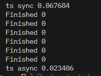

# домашнее задание по сиспрогу 1
этот репо -- домашнее задание по курсу системное программирование от вк образования.

текст задания лежит в 1/task_rus (форматирование автора)

решение лежит в 1/solution.c

для запуска: make run

еще можно заменить #define PRINT_SORTED_ARRAYS 0 на 1 и тогда будет печатать отсортированные массивы но у вас быстро буфер забьется.

в двух словах: имплементация merge sort на си с использованием корутин

